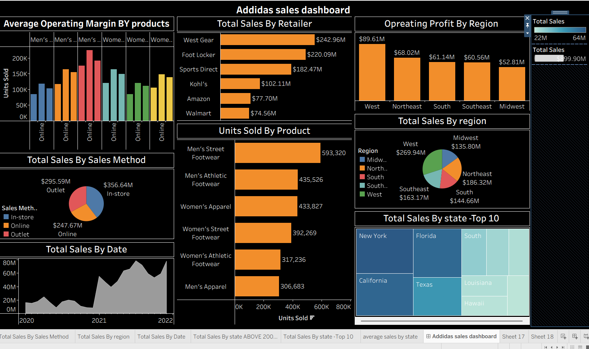

# Adidas Sales Dashboard

## Project Overview
This project presents an interactive Adidas Sales Dashboard created using Tableau.  
The dashboard provides insights into sales performance, operating profit, regional analysis, retailer performance, and product-wise sales trends.

---

## Tools Used
- Tableau
- Excel
- Data Visualization
- Dashboard Design

---

## Dashboard Features
- Total Sales Analysis
- Operating Profit by Region
- Retailer-wise Sales Comparison
- Product-wise Units Sold
- Sales Method Distribution
- State-wise Sales Analysis
- Time Series Sales Trends

---

## Key Insights
- West region generated the highest operating profit.
- In-store sales contributed the highest revenue.
- Men's Street Footwear recorded the highest units sold.
- Sales showed significant growth during 2021.

---

## Files Included
- Tableau Dashboard File
- Raw Dataset
- Dashboard Screenshot

---

## Dashboard Preview

---

## Author
Anuja Barya
